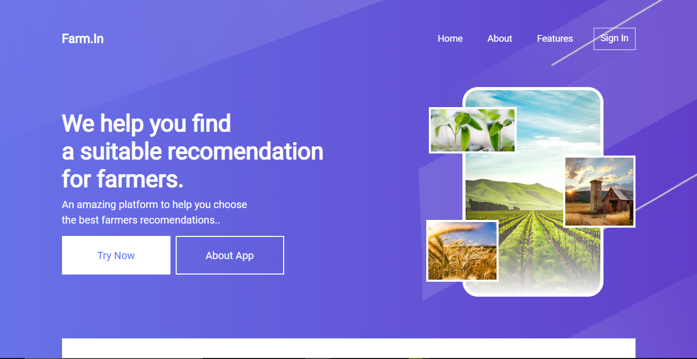
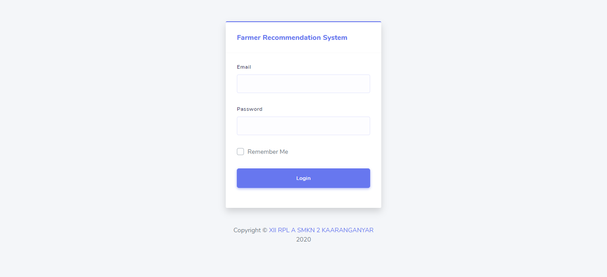
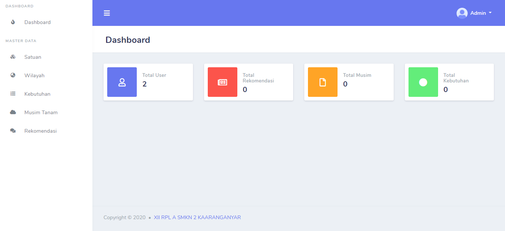

<p align="center"><a href="https://laravel.com" target="_blank"></a></p>

<h1 align="center">
  Farmer Recommendation System (Laravel)
  <br>
</h1>            

<p align="center">
    <a href="https://travis-ci.org/laravel/framework"></a>
    <a href="https://packagist.org/packages/laravel/framework"></a>
    <a href="https://packagist.org/packages/laravel/framework"></a>
    <a href="https://packagist.org/packages/laravel/framework"></a>
</p>

# Introduce

Farmer recommendation system is a simple application for managing needs & recommendation needs for farmers

# Overview





## Prerequiste

- [Composer](https://getcomposer.org/) - Download and Install Composer

### Installation

Install the dependencies and start the server.

```sh
$ git clone https://github.com/erpeel-a/Farmer-Recommendation-System.git
$ cd Farmer-Recommendation-System
$ composer install
$ cp .env.example to .env
$ change setting for database & generate key with php artisan key:generate
$ Call Action to Migrate Database & seeder with php artisan migrate --seed
$ php artisan serve
```

## Credits
This software was developed with
- [Laravel](https://laravel.com/)
- [Bootstrap](https://getbootstrap.com/)

## Support

<a href="https://www.buymeacoffee.com/" target="_blank"></a>

## The Project is MIT licensed.

Contributors

-   [Muhamad Zainal Arifin](https://github.com/Zainal21)
-   [Hendra Agil Syaputra](https://github.com/hendraaagil)
-   [Niko Febriyanto](https://github.com/NFebri)
-   [Muhammad Afin](https://github.com/muhammadafin)

2020 © XII RPL A SMKN 2 Karanganyar
